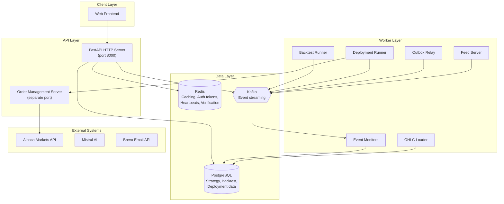
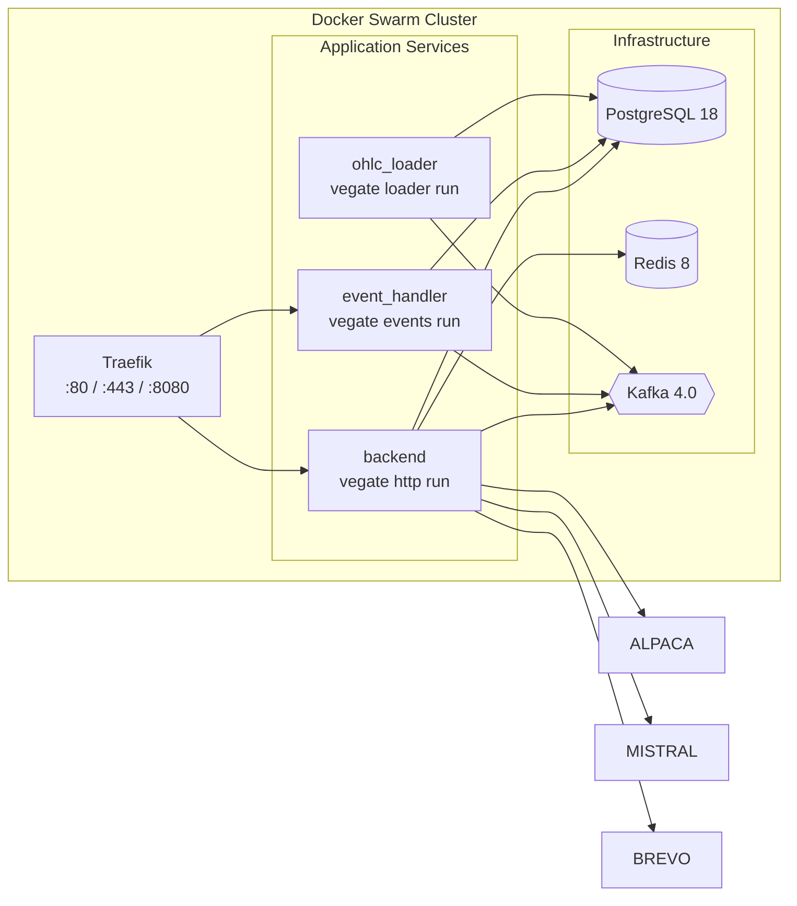
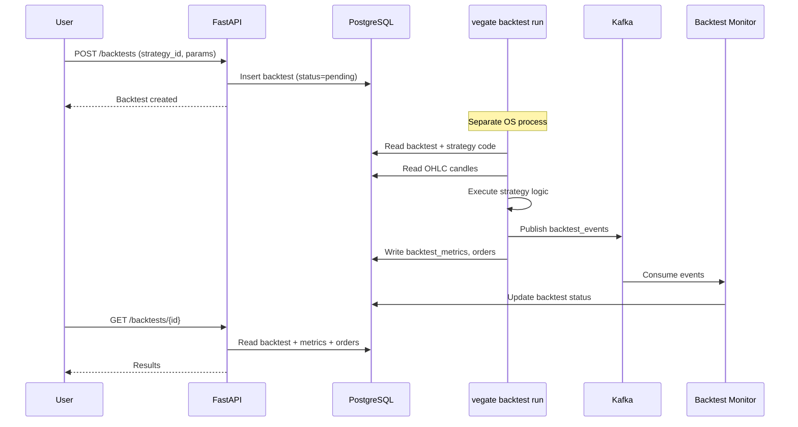
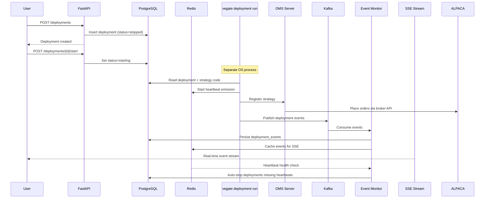
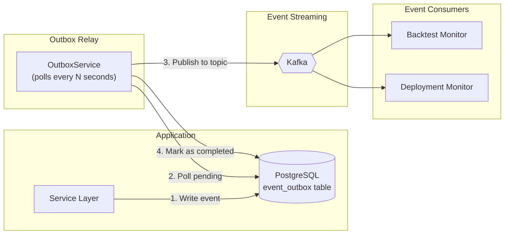
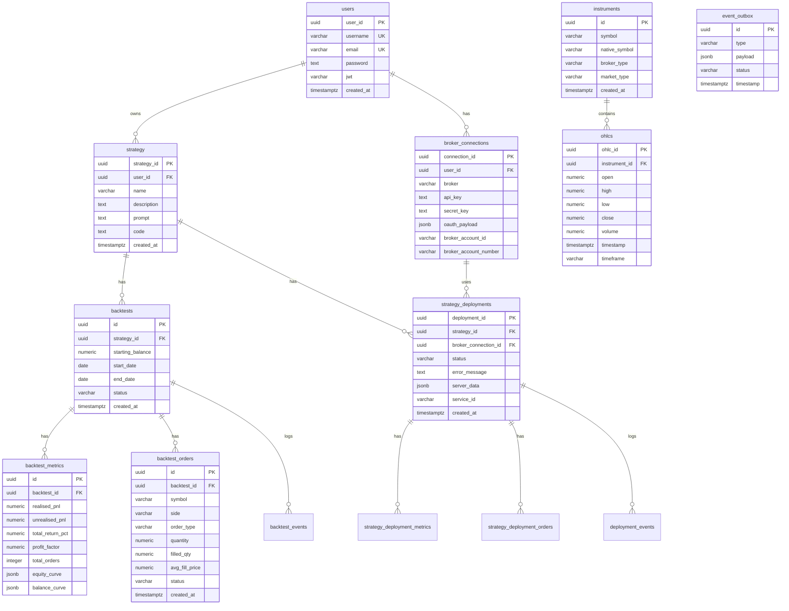

# Vegate

**Algorithmic Trading Platform** — Write, backtest, and deploy quantitative trading strategies to live markets.

> Vegate is a modular monolith backend that manages the full lifecycle of algorithmic trading: strategy authoring (with optional AI assistance), historical backtesting against OHLC market data, live deployment via broker APIs, and real-time monitoring through Server-Sent Events.

---

## Tech Stack

| Layer                | Technology                                        |
| -------------------- | ------------------------------------------------- |
| **Language**         | Python 3.13                                       |
| **Web Framework**    | FastAPI (async)                                   |
| **ASGI Server**      | Uvicorn                                           |
| **CLI Framework**    | Click                                             |
| **ORM**              | SQLAlchemy 2.0 + Alembic                          |
| **Database**         | PostgreSQL 18                                     |
| **Cache / State**    | Redis 8                                           |
| **Message Broker**   | Apache Kafka 4.0 (KRaft)                          |
| **AI / LLM**         | Pydantic AI + Mistral                             |
| **Broker API**       | Alpaca Markets                                    |
| **Email**            | Brevo (Sendinblue)                                |
| **Auth**             | JWT + Argon2                                      |
| **Package Manager**  | `uv`                                              |
| **Containerization** | Docker, Docker Compose (dev), Docker Swarm (prod) |
| **Reverse Proxy**    | Traefik                                           |
| **CI/CD**            | GitHub Actions                                    |

---

## System Architecture

### High-Level Overview



### Container Architecture



---

## Data Flow

### Backtest Flow



### Live Deployment Flow



### Transactional Outbox Pattern



---

## Database Schema

### Entity-Relationship Diagram



---

## API Endpoints

### Authentication (`/auth`)

| Method | Path                            | Auth     | Description                     |
| ------ | ------------------------------- | -------- | ------------------------------- |
| POST   | `/auth/register`                | —        | Register account                |
| POST   | `/auth/login`                   | —        | Login                           |
| POST   | `/auth/logout`                  | Optional | Logout                          |
| POST   | `/auth/verify-email/request`    | —        | Request email verification code |
| POST   | `/auth/verify-email`            | —        | Verify email with code          |
| POST   | `/auth/change-username/request` | Yes      | Request username change         |
| POST   | `/auth/change-username`         | Yes      | Confirm username change         |
| POST   | `/auth/change-password/request` | Yes      | Request password change         |
| POST   | `/auth/change-password`         | Yes      | Confirm password change         |
| POST   | `/auth/change-email/request`    | Yes      | Request email change            |
| POST   | `/auth/change-email`            | Yes      | Confirm email change            |
| POST   | `/auth/reset-password/request`  | —        | Request password reset          |
| PATCH  | `/auth/reset-password`          | —        | Confirm password reset          |

### Users (`/users`)

| Method | Path        | Auth | Description          |
| ------ | ----------- | ---- | -------------------- |
| GET    | `/users/me` | Yes  | Current user profile |

### Strategies (`/strategy`)

| Method | Path                         | Auth | Description                      |
| ------ | ---------------------------- | ---- | -------------------------------- |
| POST   | `/strategy`                  | Yes  | Create strategy                  |
| GET    | `/strategy`                  | Yes  | List strategies (paginated)      |
| GET    | `/strategy/{id}`             | Yes  | Get strategy details             |
| PATCH  | `/strategy/{id}`             | Yes  | Update strategy name/description |
| DELETE | `/strategy/{id}`             | Yes  | Delete strategy                  |
| GET    | `/strategy/{id}/code`        | Yes  | Get strategy code                |
| PUT    | `/strategy/{id}/code`        | Yes  | Upload strategy code (.py)       |
| PATCH  | `/strategy/{id}/code`        | Yes  | Update strategy code             |
| GET    | `/strategy/{id}/backtests`   | Yes  | List backtests for strategy      |
| GET    | `/strategy/{id}/deployments` | Yes  | List deployments for strategy    |

### Backtests (`/backtests`)

| Method | Path                     | Auth | Description                            |
| ------ | ------------------------ | ---- | -------------------------------------- |
| POST   | `/backtests`             | Yes  | Create backtest                        |
| GET    | `/backtests`             | Yes  | List backtests (paginated, filterable) |
| GET    | `/backtests/{id}`        | Yes  | Get backtest with metrics              |
| DELETE | `/backtests/{id}`        | Yes  | Delete backtest                        |
| GET    | `/backtests/{id}/orders` | Yes  | Get backtest orders                    |

### Deployments (`/deployments`)

| Method | Path                              | Auth | Description                  |
| ------ | --------------------------------- | ---- | ---------------------------- |
| POST   | `/deployments`                    | Yes  | Create deployment            |
| GET    | `/deployments`                    | Yes  | List deployments (paginated) |
| GET    | `/deployments/{id}`               | Yes  | Get deployment details       |
| POST   | `/deployments/{id}/start`         | Yes  | Start deployment             |
| POST   | `/deployments/{id}/stop`          | Yes  | Stop deployment              |
| GET    | `/deployments/{id}/orders`        | Yes  | Get deployment orders        |
| GET    | `/deployments/{id}/events`        | Yes  | Get deployment event log     |
| GET    | `/deployments/{id}/events/stream` | Yes  | SSE stream of live events    |

### Markets (`/markets`)

| Method | Path            | Auth | Description                           |
| ------ | --------------- | ---- | ------------------------------------- |
| GET    | `/markets/info` | —    | List instruments (paginated)          |
| GET    | `/markets/bars` | —    | Get OHLC bars (paginated, filterable) |

### Broker Connections (`/broker-connections`)

| Method | Path                                        | Auth | Description              |
| ------ | ------------------------------------------- | ---- | ------------------------ |
| POST   | `/broker-connections`                       | Yes  | Create broker connection |
| GET    | `/broker-connections`                       | Yes  | List connections         |
| GET    | `/broker-connections/{id}`                  | Yes  | Get connection details   |
| DELETE | `/broker-connections/{id}`                  | Yes  | Delete connection        |
| GET    | `/broker-connections/alpaca/oauth`          | Yes  | Get Alpaca OAuth URL     |
| GET    | `/broker-connections/alpaca/oauth/callback` | Yes  | Handle OAuth callback    |

### Contact (`/contact`)

| Method | Path       | Auth | Description         |
| ------ | ---------- | ---- | ------------------- |
| POST   | `/contact` | —    | Submit contact form |

---

## CLI Commands

Every component runs as a subcommand of the unified `vegate` CLI:

| Command                   | Subcommand     | Description                                         |
| ------------------------- | -------------- | --------------------------------------------------- |
| `vegate http`             | `run`          | Start FastAPI HTTP server (Uvicorn, port 8000)      |
| `vegate backtest`         | `run`          | Execute a single backtest by ID                     |
| `vegate backtest monitor` | `run`          | Consume backtest Kafka events and persist to DB     |
| `vegate deployment`       | `run`          | Execute a live strategy deployment                  |
| `vegate monitor`          | `run`          | Consume deployment events + heartbeat health checks |
| `vegate monitor`          | `run-backtest` | Alias for `backtest monitor run`                    |
| `vegate feed`             | `run`          | Start OHLC live feed server (WebSocket)             |
| `vegate oms`              | `run`          | Start Order Management System                       |
| `vegate loader`           | `run`          | Load historical OHLC data from broker               |
| `vegate outbox`           | `run`          | Relay transactional outbox → Kafka                  |
| `vegate db`               | `upgrade`      | Run Alembic migrations                              |

---

## Project Structure

```
vegate-backend/
├── src/
│   ├── main.py                   # Entry point → vegate CLI
│   ├── config.py                 # Configuration (env + config.yaml)
│   ├── util.py                   # Shared utilities
│   ├── user_strategy.py          # BaseStrategy subclass for user code
│   ├── cli/                      # Click CLI framework
│   │   ├── main.py               # Root CLI group
│   │   └── command/              # Subcommands (backtest, deployment, http, ...)
│   ├── core/                     # Shared infrastructure
│   │   ├── db/                   # SQLAlchemy engine, sessions, base model
│   │   ├── kafka/                # Kafka producers/consumers (async + sync)
│   │   ├── redis/                # Redis clients (async + sync)
│   │   ├── event/                # Event models + deserialisation
│   │   ├── strategy.py           # Abstract Strategy base class
│   │   ├── schema.py             # Pydantic base model
│   │   └── protocol/             # Closeable protocols
│   ├── module/                   # Business modules
│   │   ├── api/                  # FastAPI app setup, middleware, DI registry
│   │   ├── auth/                 # Registration, login, password/email changes
│   │   ├── backtest/             # Backtesting engine + models
│   │   ├── broker/               # Broker abstractions (Alpaca, Tradier, cTrader)
│   │   ├── broker_connections/   # User broker account connections
│   │   ├── contact/              # Public contact form
│   │   ├── deployment/           # Live strategy deployment engine
│   │   ├── email/                # Email service (Brevo)
│   │   ├── event_bus/            # Event publishing + transactional outbox
│   │   ├── jwt/                  # JWT token service
│   │   ├── markets/              # Instruments, OHLC bars, feeds
│   │   ├── strategy/             # Strategy CRUD + AI generation
│   │   └── user/                 # User model
│   └── alembic/                  # 38 database migration files
├── tests/                        # pytest suite (unit + integration)
├── scripts/                      # Shell helpers
├── Dockerfile
├── dev-compose.yaml              # Dev: postgres + redis + kafka
├── prod-compose.yaml             # Prod: Docker Swarm stack
├── config.yaml                   # OHLC feed config (symbols, timeframes)
├── pyproject.toml                # Dependencies + pytest config
└── alembic.ini                   # Alembic configuration
```

---

## Key Design Patterns

- **Modular Monolith** — Single codebase, single Docker image; different entrypoint commands for different service roles.
- **CLI-First Architecture** — Everything (HTTP server, workers, loaders, monitors) is a subcommand of the `vegate` Click CLI.
- **Process Isolation** — Each backtest and live deployment runs in a separate OS process (`multiprocessing.Process`) for safety and resource isolation.
- **Transactional Outbox** — Events are first written to the `event_outbox` table in the same DB transaction as the business operation, then relayed to Kafka by a polling service. This guarantees at-least-once delivery without distributed transactions.
- **Heartbeat Health Monitoring** — Deployed strategies emit heartbeats to Redis. A monitor service automatically transitions deployments to `suspicious` or `stopped` if heartbeats are missed.
- **Async + Sync Coexistence** — FastAPI/asyncpg/aiokafka for I/O-bound HTTP and event handling. Sync psycopg2/kafka-python for CPU-bound worker processes that don't run an event loop.
- **SSE for Real-Time** — Deployment events streamed to frontends via Server-Sent Events with per-deployment `asyncio.Queue`.

---

## Getting Started

### Prerequisites

- Python 3.13+
- `uv` package manager
- Docker + Docker Compose (for infrastructure)

### Setup

```bash
# Clone the repository
git clone https://github.com/your-org/vegate-backend
cd vegate-backend

# Copy environment file
cp .env.example .env

# Install dependencies
uv sync

# Start infrastructure (PostgreSQL, Redis, Kafka)
docker compose -f dev-compose.yaml up -d

# Run database migrations
uv run src/main.py db upgrade

# Start the HTTP server
uv run src/main.py http run
```

### Running Tests

```bash
uv run pytest
uv run pytest -m "not integration"   # unit tests only
uv run pytest -m "integration"       # integration tests only
```

---

## Deployment

Vegate deploys as a Docker Swarm stack behind a Traefik reverse proxy, orchestrated via GitHub Actions CI/CD.

### Production Stack

```yaml
# prod-compose.yaml (abbreviated)
services:
  backend:      # vegate http run --upgrade-db
  event_handler:# vegate events run
  ohlc_loader:  # vegate loader run
  postgres:     # PostgreSQL 18
  redis:        # Redis 8
  traefik:      # Reverse proxy (ports 80, 443, 8080)
```

The CI/CD pipeline builds the Docker image, pushes to Docker Hub, and deploys to a Swarm cluster on push to `main`.
