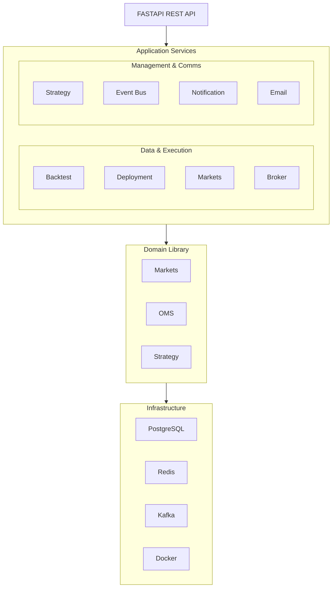
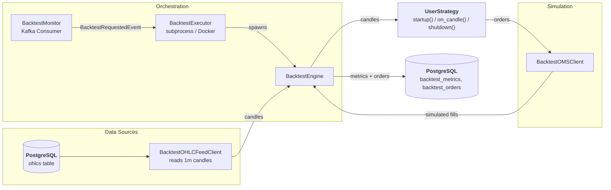
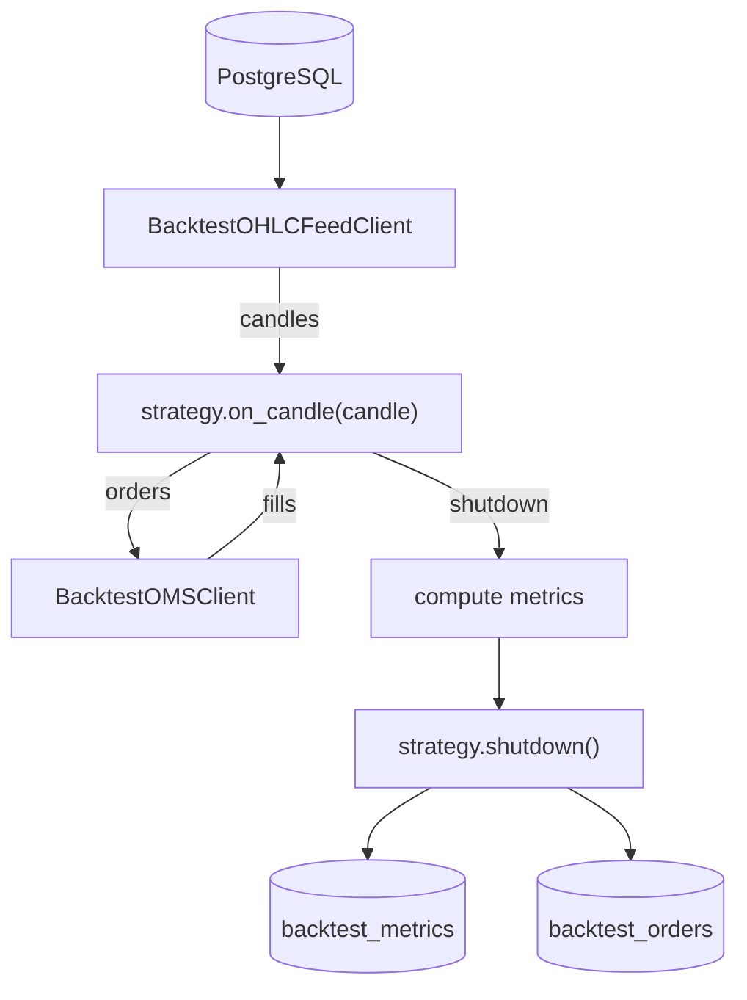
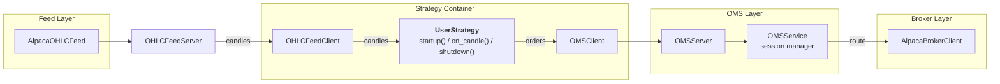
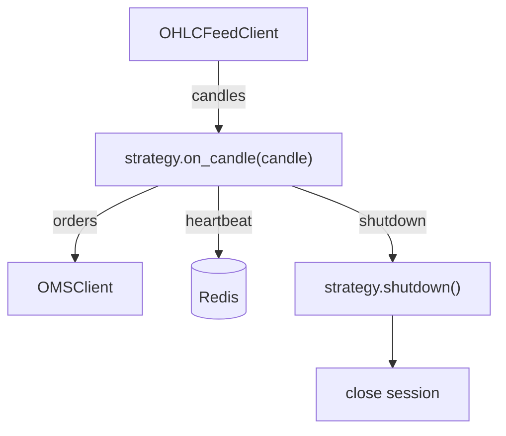
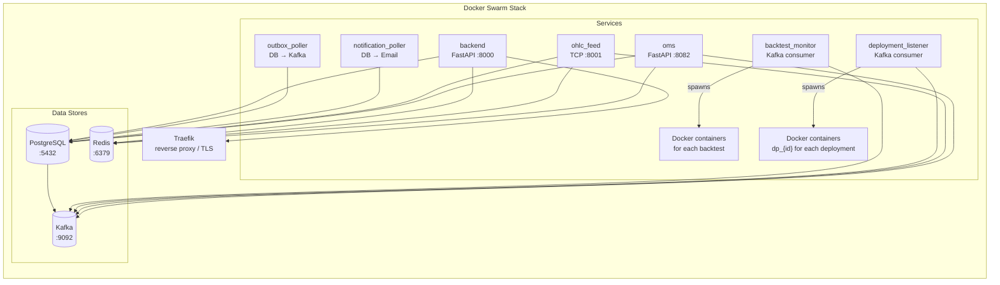

[](https://www.python.org/downloads/release/python-3130/)
[](https://github.com/JadoreThompson/vegate-backend/actions/workflows/build.yaml)
[](LICENCE)

# Vegate

Vegate is an open-source, event-driven algorithmic trading platform for backtesting and live-trading across multiple brokers. It is built with a modular architecture — every component (data loaders, market feeds, broker clients, order management, execution engines) is a pluggable module that can be swapped, extended, or composed independently.

## Features

- **Backtesting Engine** — replay historical OHLC data through your strategy and compute PnL, equity curves, and performance metrics
- **Live Trading** — deploy strategies to Docker containers that connect to live market feeds and broker APIs
- **Pluggable Data Loaders** — fetch historical OHLC data from any provider (Alpaca built-in); implement `OHLCLoader` to add your own
- **Pluggable Market Feeds** — stream live OHLC via a TCP socket server; implement `OHLCFeed` for any data source
- **Pluggable Broker Clients** — trade through any broker by implementing `BrokerClient` (Alpaca built-in)
- **Order Management System (OMS)** — HTTP server that manages broker sessions, routes orders, and persists order lifecycle events
- **Strategy Lifecycle** — `startup()` / `on_candle()` / `shutdown()` hooks with injected feed, OMS, and historical data clients
- **Event-Driven Architecture** — outbox pattern with Kafka for reliable asynchronous event processing
- **CLI** — Click-based command-line tool to run backtests, deployments, feeds, OMS, migrations, and more
- **Infrastructure** — Docker Swarm deployment with PostgreSQL, Redis, and Kafka; CI/CD via GitHub Actions

## Architecture

Vegate is organised into three layers: the **domain library** (`src/vegate/`), the **application modules** (`src/module/`), and the **infrastructure** (`src/core/`). The domain library defines shared schemas and abstract interfaces that the application modules implement.



## Domain Library (`src/vegate/`)

The shared domain library defines the contracts and data types used by all other modules. It has zero application dependencies and is importable from user strategy code and all internal modules.

| Submodule   | Key Contents                                                                                                              |
| ----------- | ------------------------------------------------------------------------------------------------------------------------- |
| `markets/`  | `OHLCSchema`, `MarketType`, `Timeframe` enums, `OHLCFeedClient` (TCP socket client), `HistoricalDataClient` (REST client) |
| `oms/`      | `Order`, `OrderRequest`, `OrderType`, `OrderSide`, `OrderStatus`, `BrokerType` enums, `OMSClient`                         |
| `strategy/` | `BaseStrategy` — the abstract base class every user strategy must extend                                                  |

### `BaseStrategy`

The user-facing strategy ABC defines three lifecycle hooks and injects three clients as instance attributes:

| Hook                | Purpose                                                              |
| ------------------- | -------------------------------------------------------------------- |
| `startup()`         | Called once on initialisation — subscribe to feeds, initialise state |
| `on_candle(candle)` | Called on every new OHLC candle — core trading logic                 |
| `shutdown()`        | Called on teardown — cancel orders, close positions                  |

| Client                        | Type                   | Purpose                                                          |
| ----------------------------- | ---------------------- | ---------------------------------------------------------------- |
| `self.ohlc_feed_client`       | `OHLCFeedClient`       | Subscribe to live or backtest OHLC streams (TCP socket protocol) |
| `self.oms_client`             | `OMSClient`            | Place, modify, cancel orders and query positions/balance         |
| `self.historical_data_client` | `HistoricalDataClient` | Fetch historical OHLC data for analysis                          |

## Backtesting

### Data Flow



### Engine



### Module

The backtesting subsystem replays historical OHLC data through a strategy and computes performance metrics.

#### Engine (`engine/`)

`BacktestEngine` orchestrates the simulation:

1. Loads the user strategy via `StrategyLoader`
2. Creates a `BacktestOHLCFeedClient` that reads 1m candles from PostgreSQL
3. Creates a `BacktestOMSClient` — an in-memory simulated broker that validates balance and matches orders:
   - Market orders fill at the current candle's close price
   - Limit/stop orders trigger when price crosses the threshold
4. Iterates through candles: executes pending orders, aggregates higher timeframes from 1m data, calls `strategy.on_candle()`
5. Tracks an equity curve and computes metrics (PnL, profit factor, total return, etc.)

#### Executors (`executor/`)

Two execution strategies for running backtests:

| Executor                  | Description                                                 |
| ------------------------- | ----------------------------------------------------------- |
| `ProcessBacktestExecutor` | Runs the backtest in a child subprocess on the same machine |
| `DockerBacktestExecutor`  | Runs the backtest in an isolated Docker container           |

`BacktestExecutorFactory` selects the appropriate executor based on configuration.

#### Monitor

`BacktestMonitor` is a Kafka consumer that listens for `BacktestRequestedEvent` messages and delegates to the configured executor. It serves as the lifecycle manager for backtest jobs.

#### Models

- `Backtest` — top-level backtest record (status, timestamps, reference to strategy/configuration)
- `BacktestMetrics` — computed metrics (total PnL, profit factor, Sharpe ratio, drawdown, etc.)
- `BacktestOrder` — simulated order records with fill prices and timestamps

### CLI

```bash
# Run a single backtest by ID
uv run src/main.py backtest run --backtest-id 123e4567-e89b-12d3-a456-426614174000

# Start the backtest lifecycle monitor (Kafka consumer)
uv run src/main.py backtest monitor run
```

## Live Trading

### Data Flow



### Market Feeds & Data Loader

Data loading and live feeds live side by side under `module/markets/`.

#### Feed

The live feed subsystem is a layered architecture:

1. **`OHLCFeed`** (ABC) — connects to a broker's streaming API; `AlpacaOHLCFeed` uses WebSockets to subscribe to bar channels
2. **`FeedManager`** — registry of available feeds by symbol, market type, broker, and timeframe
3. **`OHLCFeedServer`** — TCP socket server that fans out candles from all registered feeds to subscribed client connections over a JSON-line protocol
4. **`OHLCFeedClient`** (in `vegate/`) — TCP socket client used by strategy runners; supports subscribe, heartbeat, reconnection with backoff

The feed persists every candle to the database and calls the `on_candle` callback for real-time fan-out.

#### Loader

`OHLCLoader` is an abstract base class. The built-in `AlpacaOHLCLoader` fetches bars from Alpaca's REST API and handles idempotency.

Add a new data source by subclassing `OHLCLoader` and implementing `load_candles()`.

### Broker Clients

`BrokerClient` is the abstract interface for broker integration:

```python
class BrokerClient(ABC):
    def connect(self, api_key, api_secret, oauth_token=None): ...
    def disconnect(self): ...
    def get_balance(self) -> Balance: ...
    def get_equity(self) -> Decimal: ...
    def get_position(self, symbol) -> Decimal: ...
    def place_order(self, request: OrderRequest) -> Order: ...
    def modify_order(self, order_id, **changes) -> Order: ...
    def cancel_order(self, order_id): ...
    def cancel_all_orders(self): ...
    def get_order(self, order_id) -> Order: ...
    def get_orders(self) -> list[Order]: ...
```

Add a new broker by subclassing `BrokerClient` and implementing the interface.

### Order Management System

The OMS is a full-featured HTTP service for order routing in live deployments:

| Component    | Role                                                                                                |
| ------------ | --------------------------------------------------------------------------------------------------- |
| `OMSServer`  | FastAPI server on port 8082; endpoints for sessions, orders, positions, balances                    |
| `OMSService` | In-memory session manager with Redis-backed persistence; routes orders to the active `BrokerClient` |
| `OMSClient`  | HTTP client used by strategy runners to interact with the server                                    |

Session lifecycle: a deployment creates a session (associated with a `BrokerClient` instance), places/modifies/cancels orders through it, and closes it on shutdown. Orders are persisted to `strategy_deployment_orders` and lifecycle events are published to Kafka.

### Strategy Deployment

`StrategyDeploymentRunner` is the core loop for a live strategy instance:

1. **Setup** — loads strategy code, connects to OHLC feed (TCP), creates an OMS session, subscribes to feeds
2. **Candle loop** — iterates live candles from `OHLCFeedClient.candles()`, calls `strategy.on_candle()`, sends heartbeats to Redis
3. **Shutdown** — cancels orders, closes OMS session, cleans up

#### Executors

| Executor                    | Description                                                                       |
| --------------------------- | --------------------------------------------------------------------------------- |
| `DockerDeploymentExecutor`  | Creates a Docker container named `dp_{deployment_id}` running the strategy runner |
| `ProcessDeploymentExecutor` | Runs the strategy runner in a subprocess                                          |

#### Event Listener

`DeploymentEventListenerService` consumes `DeploymentRequestedEvent` from Kafka and delegates to the configured executor. `DeploymentEventRelay` handles event publishing for status transitions.

### Engine



### Deployment Architecture

Vegate is deployed as a Docker Swarm stack with the following services:



#### Service Dependencies

| Service               | Depends On                           | Purpose                                              |
| --------------------- | ------------------------------------ | ---------------------------------------------------- |
| `backend`             | PostgreSQL, Redis                    | Serves the REST API; writes to outbox                |
| `outbox_poller`       | PostgreSQL, Kafka                    | Polls outbox table, publishes to Kafka topics        |
| `backtest_monitor`    | Kafka, Docker                        | Consumes backtest events, spawns Docker containers   |
| `deployment_listener` | Kafka, Docker                        | Consumes deployment events, spawns Docker containers |
| `ohlc_feed`           | PostgreSQL, Redis, Kafka             | Connects to broker WS, streams candles over TCP      |
| `oms`                 | PostgreSQL, Redis, Kafka, broker API | Routes orders from deployments to broker APIs        |
| `notification_poller` | PostgreSQL, email API                | Polls notification table, sends emails               |

#### Infrastructure Stack

- **PostgreSQL 18** — primary data store (OHLC data, backtest results, deployments, orders, users, outbox)
- **Redis 7/8** — session persistence, deployment heartbeats, rate limiting, caching
- **Apache Kafka 4** (KRaft mode) — event bus for decoupled microservice communication
- **Docker Swarm** — container orchestration and service discovery

### CLI

```bash
# Deploy a strategy to live trading
uv run src/main.py deployment run \
    --deployment-id 123e4567-e89b-12d3-a456-426614174000 \
    --ohlc-feed-host localhost \
    --ohlc-feed-port 8001 \
    --oms-base-url http://localhost:8082/v1

# Start the deployment lifecycle listener (Kafka consumer)
uv run src/main.py deployment listener run

# Start the live OHLC feed TCP server
uv run src/main.py markets feed run \
    --host 0.0.0.0 \
    --port 8001

# Start the Order Management System HTTP server
uv run src/main.py oms run --host 0.0.0.0 --port 8082
```

## REST API (`module/api/`)

FastAPI application providing the HTTP API layer. Routes are organised by domain:

- `auth/` — authentication (login, register, JWT tokens)
- `user/` — user management
- `strategy/` — CRUD for strategies
- `backtest/` — create and query backtests
- `deployment/` — create and manage live deployments
- `markets/` — query instruments and OHLC data
- `broker_connections/` — manage broker credentials and OAuth flows
- `contact/` — contact form submissions

## Common Modules

### Strategy Management (`module/strategy/`)

- **`StrategyService`** — CRUD for strategies, versioning, metadata
- **`StrategyLoader`** — writes user Python code to `src/user_strategy.py` and dynamically imports the `UserStrategy` class; validates it extends `BaseStrategy`
- **`agents/`** — LLM-powered agents (using `pydantic-ai-slim` with Mistral) for automated strategy generation and analysis

### Event Bus (`module/event_bus/`)

Reliable asynchronous event processing using the outbox pattern:

1. Events are written to the `EventOutbox` table in PostgreSQL within the same transaction as the business operation
2. `OutboxPoller` periodically reads unprocessed rows and publishes them to Kafka topics
3. Consumers (`BacktestMonitor`, `DeploymentEventListenerService`, etc.) process events from Kafka

This guarantees at-least-once delivery without distributed transactions. Multiple publisher implementations are available:

| Publisher              | Behaviour                                             |
| ---------------------- | ----------------------------------------------------- |
| `SyncOutboxPublisher`  | Writes to outbox synchronously (blocking)             |
| `AsyncOutboxPublisher` | Writes to outbox asynchronously                       |
| `KafkaPublisher`       | Publishes directly to Kafka (for non-critical events) |

### Notifications (`module/notification/` & `module/email/`)

- **`NotificationPoller`** — periodic DB poller that picks up pending notifications and sends them through configured channels (email, Discord)
- **`NotificationPublisher`** — publishes notification events
- **Email services** — pluggable email delivery via Brevo, Postmark, or SMTPGo; selected via `EmailServiceFactory`

### CLI Reference

The CLI is built with [Click](https://click.palletsprojects.com/) and invoked via `uv run src/main.py`.

```bash
# Start the FastAPI REST API server
uv run src/main.py http run

# Start the outbox poller (PostgreSQL -> Kafka)
uv run src/main.py outbox run --interval 5 --batch-size 1000

# Start the notification poller (PostgreSQL -> email)
uv run src/main.py notification poller run \
    --interval 2 \
    --batch-size 1000 \
    --timeout 5

# Load historical OHLC data from a broker
uv run src/main.py markets loader run \
    --broker alpaca \
    --symbol ETH/USD \
    --market-type crypto \
    --timeframe 1m \
    --start-date 2026-01-01

# Run Alembic database migrations
uv run src/main.py db upgrade
```

## Getting Started

### Prerequisites

- Python 3.13+
- [uv](https://docs.astral.sh/uv/) package manager
- Docker and Docker Compose (for infrastructure and live trading)

### Setup

```bash
# Clone the repository
git clone https://github.com/vegate/vegate-backend.git
cd vegate-backend

# Create virtual environment and install dependencies
uv sync

# Configure environment
cp .env.example .env
# Edit .env with your database, broker, and API credentials

# Start infrastructure (PostgreSQL, Redis, Kafka)
docker compose -f dev-compose.yaml up -d

# Run database migrations
uv run src/main.py db upgrade

# Start the API server
uv run src/main.py http run
```

### Example Strategy

```python
from vegate.oms.schema import OrderRequest
from vegate.oms.enums import OrderType, OrderSide
from vegate.markets.enums import Timeframe
from vegate.strategy.base import BaseStrategy


class UserStrategy(BaseStrategy):
    def startup(self):
        self.ohlc_feed_client.subscribe([{
            "symbol": "ETH/USD",
            "broker_type": "alpaca",
            "market_type": "crypto",
            "timeframe": [Timeframe.m1],
        }])

    def on_candle(self, candle):
        position = self.oms_client.get_position("ETH/USD")
        if position == 0:
            self.oms_client.place_order(
                OrderRequest(
                    symbol="ETH/USD",
                    side=OrderSide.buy,
                    order_type=OrderType.market,
                    quantity=1,
                )
            )

    def shutdown(self):
        self.oms_client.cancel_all_orders()
```
